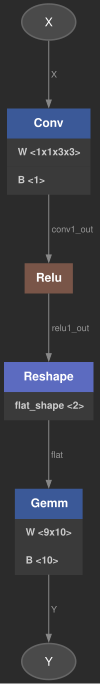

# Tensor Compiler

Educational ONNX graph importer and graph toolkit:
- import ONNX model into an internal compute graph (`GraphBuilder`)
- validate graph consistency (`verify`)
- export graph to GraphViz `.dot`

## How to Install

```bash
git clone <git@github.com:daniilgriga/TensorCompiler.git>
cd TensorCompiler/
```

## How to Build

```bash
# Debug + tests
cmake -S . -B build/debug -DCMAKE_BUILD_TYPE=Debug -DBUILD_TESTS=ON
cmake --build build/debug -j

# Release
cmake -S . -B build/release -DCMAKE_BUILD_TYPE=Release -DBUILD_TESTS=OFF
cmake --build build/release -j
```

## How to Run

### Print Graph Stats

```bash
./build/debug/tc_main tests/models/conv_relu_gemm.onnx
```

### Export Graph to DOT

```bash
./build/debug/tc_main tests/models/conv_relu_gemm.onnx --dot output/conv_relu_gemm.dot
```

## Graph Visualization (SVG)

Convert generated DOT to SVG with GraphViz:

```bash
dot -Tsvg output/conv_relu_gemm.dot -o output/conv_relu_gemm.svg
```

Project already contains sample visualizations:
- `output/conv_relu_gemm.svg`
- `output/adv_inception_v3.svg`

Example:



## Tests

### Build Tests

```bash
cmake -S . -B build/tests -DCMAKE_BUILD_TYPE=Debug -DBUILD_TESTS=ON
cmake --build build/tests -j
```

### Run Tests

```bash
ctest --test-dir build/tests --output-on-failure
```
